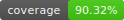
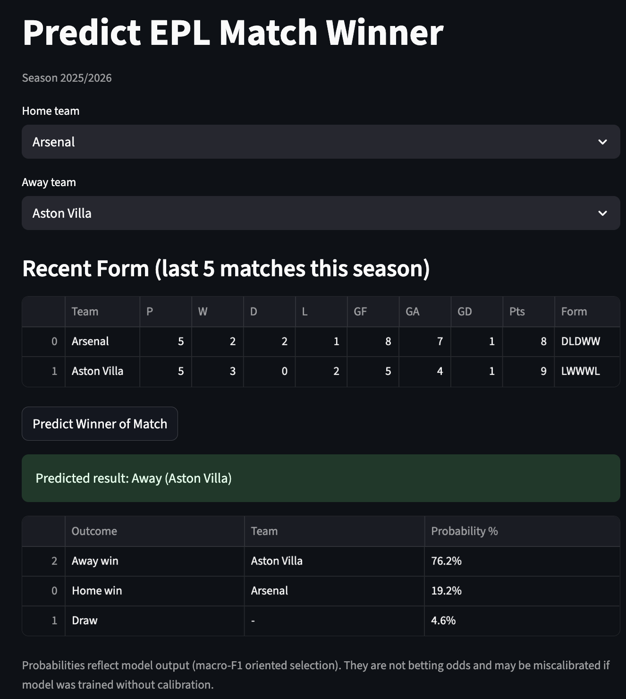

<!-------->
[](https://www.python.org/)
[](https://streamlit.io/)
[](https://black.readthedocs.io/)


[](https://pre-commit.com/)
[](./LICENSE)
[](https://github.com/r39132/predict-epl-match-winner/actions/workflows/ci.yml)


# Predict EPL Match Winner

An end-to-end ML project that downloads ~20 years of EPL results, builds features,
trains and evaluates models locally, and serves predictions via a **Streamlit** UI. All operations are local-only (no Vertex AI / GCS dependencies).



## Tech
- Python 3.12.3, `uv`
- Streamlit UI for local inference
- Tooling: black, ruff (lint + import sorting), mypy, pytest + coverage, pre-commit & pre-push

## Quick start
```bash
# 0) env
uv venv --python 3.12.3
uv sync  # installs main + dev dependencies
uv pip install -e ".[dev]"  # optional if you want editable install (uv sync already handled deps)
pre-commit install
pre-commit install --hook-type pre-push

# 1) data (last 20 seasons by default)
uv run pemw download-data --seasons 20

# 2) features + local training (note CLI commands use kebab-case now). Feature set includes:
#    - Elo ratings + expectation
#    - Rolling form/goal diff (5 & 10)
#    - Implied probabilities from odds
#    - Rest days & elo/market interaction
uv run pemw prepare-data
uv run pemw train-local
uv run pemw evaluate-local

# Use gradient boosting model (may improve accuracy):
uv run pemw train-local --model-type hgb --min-team-freq 5
uv run pemw evaluate-local --model-type hgb --min-team-freq 5
# Calibrated logistic regression probabilities
uv run pemw train-local --calibrate

# (Optional) quick hyperparameter search for LogisticRegression C
uv run pemw tune-logreg
# (Optional) quick hyperparameter search for HistGradientBoosting
uv run pemw tune-hgb

# 3) Auto-select best model
#    Selection criteria: macro F1 (primary) with overall accuracy as a tie-breaker.
#    Both logistic regression and HistGradientBoosting are cross-validated via TimeSeriesSplit.
uv run pemw auto-select

# 4) Streamlit UI (local)
streamlit run src/pemw/ui/app.py

## Notes
- Import sorting is handled by Ruff's `I` rules; a separate isort step is no longer needed.
- If you previously had `isort` installed, you can remove it safely (`uv remove isort`).
- Model improvements implemented:
	- Added imputers (median / most_frequent) to handle NaNs in odds.
	- Dropped always-NaN numeric columns automatically.
	- Engineered additional features (rolling 10, implied probs, rest days, interaction).
	- Added class_weight=balanced and max_iter=1000.
	- Added simple time-series aware C tuning command `tune-logreg`.
	- Added HGB model option + tuning (`tune-hgb`), rare-team pruning, calibration flag, and automatic model selection (`auto-select`) using macro F1 then accuracy.
	- Removed cloud dependencies for a fully local workflow.
```
